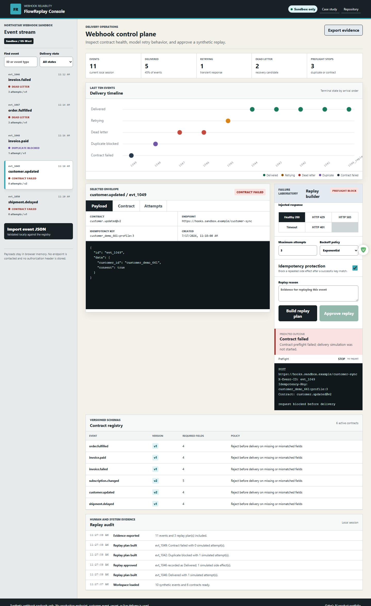
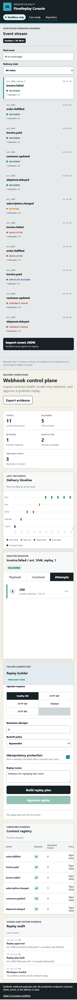

# FlowReplay Console

FlowReplay Console is a local-first webhook reliability workbench. It validates synthetic event envelopes against versioned contracts, models transient and permanent responses, exposes retry timing, prevents repeated side effects with idempotency keys, and keeps dead-letter replay behind a reasoned human approval.

[Live demo](https://jubjub-cpu.github.io/flowreplay-console/) | [Portfolio](https://jubjub-cpu.github.io/gabe-ai-product-portfolio/) | [v1.0.0 release](https://github.com/jubjub-cpu/flowreplay-console/releases/tag/v1.0.0)

## Business Problem

Webhook failures are easy to treat as a single red status. In practice, teams need to distinguish contract drift from transient delivery failures, understand retry timing, prove that duplicate events do not repeat side effects, and preserve an auditable recovery decision. FlowReplay makes those boundaries visible in one deterministic sandbox.

## Target User

API product engineers, integration developers, platform teams, technical product managers, and support engineers responsible for event-driven workflows.

## Primary Workflow

1. Review ten synthetic webhook envelopes across delivered, retrying, dead-letter, duplicate, and contract-failed states.
2. Inspect the payload, versioned contract checks, and prior delivery attempts.
3. Choose a deterministic response injection: healthy, HTTP 429, HTTP 503, timeout, or HTTP 401.
4. Configure one to five attempts, fixed/linear/exponential backoff, and idempotency protection.
5. Build a replay plan without contacting the endpoint.
6. Provide a recovery reason and approve the replay at a separate human gate.
7. Verify the appended event, simulated side-effect count, HTTP preview, and replay audit.
8. Import one local event JSON file or export a portable evidence report.

## Reliability Model

- **Contract preflight:** required payload paths and JavaScript primitive types are checked before a delivery simulation can start.
- **Retry classification:** 408, 425, 429, and selected 5xx responses are transient; 401 and other non-retryable responses terminate immediately.
- **Backoff:** fixed, linear, and exponential schedules use a visible 15-second base delay.
- **Idempotency:** a completed key returns a synthetic HTTP 208 no-op with zero side effects.
- **Dead-letter handling:** exhausted or permanent attempts end in the dead-letter state.
- **Human recovery:** replay approval requires a reason of at least 12 characters and preserves the source event, plan, and outcome.

All behavior is deterministic. No production endpoint, hosted queue, signing secret, or live webhook is used.

## Architecture

- `assets/replay-engine.mjs`: contract validation, response classification, retry/backoff modeling, idempotency, replay approval, imports, summaries, and report assembly.
- `assets/app.js`: event filtering, payload/contract/attempt views, Canvas timeline, replay builder, human gate, import/export, and audit rendering.
- `data/events.json`: ten fictional events and six versioned contracts.
- `tests/replay-engine.test.mjs`: engine, contract, retry, idempotency, dead-letter, approval, import, and export checks.
- `tests/browser-smoke.mjs`: desktop/mobile recovery, contract stop, duplicate no-op, Canvas, keyboard, import/export, failure-state, console, request, and overflow checks.

See [docs/ARCHITECTURE.md](docs/ARCHITECTURE.md) and [docs/CASE_STUDY.md](docs/CASE_STUDY.md).

## Run Locally

```powershell
powershell -ExecutionPolicy Bypass -File .\tools\static-server.ps1 -NodePath "C:\path\to\node.exe"
```

Open `http://127.0.0.1:4192/`.

## Validation

```powershell
powershell -ExecutionPolicy Bypass -File .\tests\validate.ps1 -NodePath "C:\path\to\node.exe"
node .\tests\browser-smoke.mjs
```

Exact evidence is recorded in [docs/VALIDATION.md](docs/VALIDATION.md).

## Accessibility, Privacy, and Security

- Native controls, semantic tabs and tables, skip navigation, visible focus, responsive layouts, and reduced-motion support.
- All payloads, endpoints, identifiers, attempts, and contracts are fictional.
- Imported JSON remains in browser memory. There is no backend, analytics, cookie, secret, credential, signing key, or network delivery.
- Contract failures stop before delivery; idempotency remains enabled by default; replay requires human evidence.
- The exported report states that its evidence came from a deterministic local simulation.

## Screenshots





## Limitations

- Primitive path checks are not a full JSON Schema implementation.
- Retry timing is simulated and does not model distributed clock drift, queue partitioning, or provider-specific headers.
- The idempotency store exists only for the local session.
- Signature verification, encrypted secret storage, network delivery, and persistent queues belong in a production service, not this static demo.
